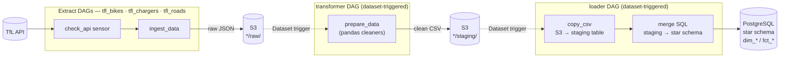

# TfL Data Pipeline

End-to-end data engineering pipeline extracting Transport for London (TfL) data to populate an analytics-ready dimensional Data Warehouse.

## Stack
**Python · Airflow · AWS S3 / MinIO · PostgreSQL · Pandas · Metabase**

## Data Sources (TfL API)
* `BikePoints`: Docking station availability.
* `Chargers`: EV chargers availability.
* `Roads`: Active road disruptions.

## Architecture
Extract (TfL API) → land raw JSON in S3 → initially clean with Pandas → stage in S3 → load star schema to Postgres

Each stage is its own Airflow DAG, chained via **Dataset-driven scheduling**: a DAG doesn't run on a cron guess, it runs when the dataset it depends on is actually updated. The three extract DAGs (`tfl_bikes`, `tfl_chargers`, `tfl_roads`) run independently on their own schedules; the shared `transformer` and `loader` DAGs each fire once *any* of their upstream datasets is emitted, and fan out per-source internally via dynamic task mapping.



* **Extract** — one factory-built DAG per source, each polling the TfL API before pulling data and landing it as raw JSON in S3, tagged with a `batch_id`.
* **Transform** — triggered by the raw datasets; cleans/reshapes each source with Pandas and writes tidy CSVs to a staging S3 prefix.
* **Load** — triggered by the staging datasets; `COPY`s the CSV into a Postgres staging table, then runs an idempotent SQL merge (`ON CONFLICT` upserts for dimensions, composite-key dedup for facts) into the dimensional warehouse, keyed by `batch_id` so reruns and backfills are safe.
* **Visualize** — a Metabase dashboard sits on top of the warehouse for exploring the loaded data.

## Local Environment
This repository is configured for immediate, local execution. 
It uses MinIO to simulate AWS S3 locally. The `docker-compose` setup automatically provisions the required local buckets, Airflow connections, and the Metabase admin user/data warehouse connection. No cloud credentials or manual infrastructure setup are required to test the pipeline.


## Prerequisites
* **Docker Desktop** (includes Docker Compose; required to run the whole stack) — [Download](https://www.docker.com/products/docker-desktop/)

## Quickstart
Spin up the Airflow image (built from `Dockerfile` on first run), orchestration, PostgreSQL data warehouse, MinIO storage, and Metabase in one command:

```bash
docker compose up --build
```

`--build` guarantees the custom Airflow image is (re)built from the current `Dockerfile`/`requirements.txt` before starting, so the stack always reflects the code in this repo.

* Access Airflow at localhost:8080 (`admin`/`admin`).
* Access Metabase at localhost:3000 (`admin@example.com`/`MetabaseAdmin123`) — the `postgres_dw` connection is provisioned automatically by the `metabase-init` service, so the dashboard is ready to query as soon as the pipeline has loaded data.

## Configuration:
Airflow connections and variables are managed declaratively as `AIRFLOW_CONN_*` / `AIRFLOW_VAR_*` environment variables under `x-airflow-common` in `docker-compose.yaml`. To run this pipeline against real AWS S3, replace the `s3_conn` connection's values there with your AWS credentials.

Metabase's admin credentials and the name of the `postgres_dw` connection it creates are configured via environment variables on the `metabase-init` service in `docker-compose.yaml`.

## Teardown
Stop the stack while keeping all data (warehouse, MinIO buckets, Metabase setup) for next time:

```bash
docker compose down
```

Stop the stack and wipe all data, resetting everything to a clean slate (next `docker compose up` will re-run migrations, re-provision buckets, and redo the Metabase setup from scratch):

```bash
docker compose down -v
```

## License
MIT