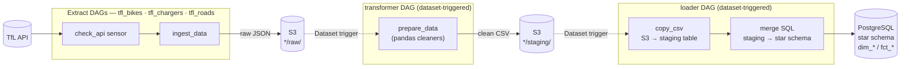

# TfL Data Pipeline

End-to-end data engineering pipeline extracting Transport for London (TfL) data to populate an analytics-ready dimensional Data Warehouse.

## Stack
**Python · Airflow (Astronomer Runtime, Docker) · AWS S3 / MinIO · PostgreSQL · Pandas**

## Data Sources (TfL API)
* `BikePoints`: Docking station availability.
* `Chargers`: EV chargers availability.
* `Roads`: Active road disruptions.

## Architecture
Extract (TfL API) → land raw JSON in S3 → initially clean with Pandas → stage in S3 → load star schema to Postgres

Each stage is its own Airflow DAG, chained via **Dataset-driven scheduling**: a DAG doesn't run on a cron guess, it runs when the dataset it depends on is actually updated. The three extract DAGs (`tfl_bikes`, `tfl_chargers`, `tfl_roads`) run independently on their own schedules; the shared `transformer` and `loader` DAGs each fire once *any* of their upstream datasets is emitted, and fan out per-source internally via dynamic task mapping.



* **Extract** — one factory-built DAG per source, each polling the TfL API before pulling data and landing it as raw JSON in S3, tagged with a `batch_id`.
* **Transform** — triggered by the raw datasets; cleans/reshapes each source with Pandas and writes tidy CSVs to a staging S3 prefix.
* **Load** — triggered by the staging datasets; `COPY`s the CSV into a Postgres staging table, then runs an idempotent SQL merge (`ON CONFLICT` upserts for dimensions, composite-key dedup for facts) into the dimensional warehouse, keyed by `batch_id` so reruns and backfills are safe.

## Local Environment
This repository is configured for immediate, local execution. 
It uses MinIO to simulate AWS S3 locally. The `docker-compose` setup automatically provisions the required local buckets and Airflow connections. No cloud credentials or manual infrastructure setup are required to test the pipeline.


## Prerequisites
* **Docker Desktop** (Required for the local environment) — [Download](https://www.docker.com/products/docker-desktop/)
* **Astronomer CLI** (Required to run Airflow) — [Install Guide](https://www.astronomer.io/docs/astro/cli/install-cli)

## Quickstart
Spin up the Airflow orchestration, PostgreSQL data warehouse, and MinIO storage:

```bash
astro dev start
```

Access Airflow at localhost:8080 (admin/admin).

## Configuration:
Airflow connections and variables are managed declaratively via `airflow_settings.yaml`. To run this pipeline against AWS S3, simply update the credentials in this file.

## License
MIT