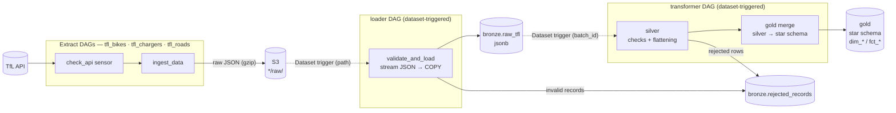

# TfL Data Pipeline

[](https://github.com/mahufa/london-transport-pipeline/actions/workflows/tests.yml)

ELT pipeline that extracts Transport for London (TfL) data into a PostgreSQL warehouse built on the medallion architecture.

**Stack:** Python · Airflow · AWS S3 / MinIO · PostgreSQL · Metabase

**Sources (TfL API):** `BikePoints` (docking station availability), `Chargers` (EV charger availability), `Roads` (active road disruptions).

## Architecture


```mermaid
flowchart LR
    API[("TfL API")]

    subgraph EX["Extract DAGs — tfl_bikes · tfl_chargers · tfl_roads"]
        CHECK["check_api sensor"] --> INGEST["ingest_data"]
    end

    subgraph LD["loader DAG (dataset-triggered)"]
        LOAD["validate_and_load\nstream JSON → COPY"]
    end

    subgraph TR["transformer DAG (dataset-triggered)"]
        SILVER["silver\nchecks + flattening"]
        GOLD["gold merge\nsilver → star schema"]
        SILVER --> GOLD
    end

    BRONZE[("bronze.raw_tfl\njsonb")]
    DLQ[("bronze.rejected_records")]
    DW[("gold\nstar schema\ndim_* / fct_*")]

    API --> CHECK
    INGEST -->|"raw JSON (gzip)"| RAWS3[("S3\n*/raw/")]
    RAWS3 -.->|"Dataset trigger (path)"| LOAD
    LOAD --> BRONZE
    LOAD -->|"invalid records"| DLQ
    BRONZE -.->|"Dataset trigger (batch_id)"| SILVER
    SILVER -->|"rejected rows"| DLQ
    GOLD --> DW
```

The DAGs are chained by **Dataset-driven scheduling**. Each producing task emits a dataset event that carries its S3 path or `batch_id`. The shared `loader` and `transformer` DAGs then use dynamic task mapping to process exactly those batches, one mapped instance per batch, so a failing batch doesn't hold back the others.

* **Extract:** one factory-built DAG per source checks that the API is up, then streams the response, gzip-compressed when the API supports it, straight into S3.
* **Load (bronze):** streams each file through `ijson`, validates the records and `COPY`s them into `bronze.raw_tfl` as `jsonb`. Memory stays flat, deduplication runs in SQL, invalid records go to the dead-letter table `bronze.rejected_records`, and reruns are idempotent (delete-then-insert in one transaction).
* **Transform (silver → gold):** silver views flatten and type-check the payloads. Invalid rows are rejected to the dead-letter table, and a batch fails if more than 10% of its records were rejected. Valid rows are merged idempotently into the gold star schema.
* **Visualize:** Metabase on top of the warehouse.

## Quickstart
Requires [Docker Desktop](https://www.docker.com/products/docker-desktop/). MinIO stands in for S3, and buckets, connections and Metabase are provisioned automatically, so no cloud credentials are needed.

```bash
docker compose up --build   # start
docker compose down         # stop, keep data
docker compose down -v      # stop, wipe all data
```

* Airflow: localhost:8080 (`admin`/`admin`)
* Metabase: localhost:3000 (`admin@example.com`/`MetabaseAdmin123`)

The warehouse schema in `db_init/` is applied only to an empty volume, so run `docker compose down -v` after changing it.

## Configuration
Connections and variables are set as `AIRFLOW_CONN_*` / `AIRFLOW_VAR_*` in `docker-compose.yaml`. To use real AWS S3, replace the `s3_conn` values there. To get task failure alerts in Microsoft Teams, uncomment `AIRFLOW_CONN_TEAMS` and set your webhook URL; without it, failures are only logged.

## Testing
```bash
docker build --target test -t tfl-airflow:ci .
docker run --rm -v "$PWD:/opt/airflow/project" -w /opt/airflow/project -e PYTHONPATH=/opt/airflow/project \
  tfl-airflow:ci python -m pytest -p no:cacheprovider tests
```
* **Unit tests:** DAG integrity, JSON validation, `COPY` formatting, dataset-event helpers.
* **Integration tests** (`tests/integration/`): dead-letter routing, deduplication, rerun idempotency and the reject-ratio check, run against a real PostgreSQL. Set `DW_TEST_DSN` to a throwaway database, because the schema is recreated on every run. Without it, these tests are skipped.
* **CI:** GitHub Actions runs the full suite against a PostgreSQL service container on every push.

## Known Limitations
* **Rejected records are buffered in memory** and written once at the end of each batch. That's negligible at TfL volumes, but memory would grow on a large, mostly invalid input.
* **A batch can miss its transformer run.** When two bronze events land within milliseconds, the second batch may wait for the next event. The planned dbt migration will pick batches from state instead of event extras.

## Roadmap
* Move silver and gold to dbt, with dbt tests.

## License
MIT
